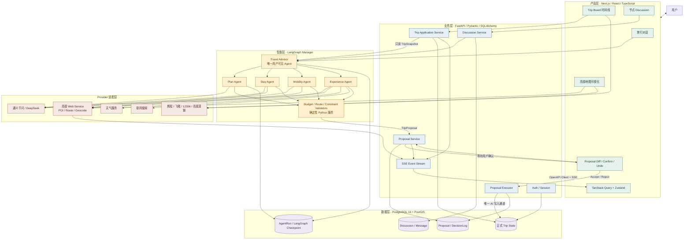

# AI 旅行 Agent High-level 系统架构



## 如何理解这张图

### 1. Next.js 是产品界面，不承担核心 Agent 逻辑

Next.js 负责对话、时间线、地图、节点讨论和 Proposal 确认。它通过 FastAPI OpenAPI 自动生成的 TypeScript Client 调用后端，通过 SSE 接收流式 Token、工具进度、路线更新和 Proposal 状态。

### 2. FastAPI 是业务边界

FastAPI 管理认证、Trip CRUD、Discussion、Proposal 和正式状态写入。任何前端或 Agent 都不能绕过这一层直接修改数据库。

### 3. LangGraph 管理复杂智能流程

用户只看到一个 `TravelAdvisor`。它根据任务按需调用 Plan、Stay、Mobility 和 Experience Agents。预算、路线和约束校验仍由确定性 Python 服务完成。

### 4. Agent 只输出建议

Specialist Agent 的结果经过 Validator 后形成 `TripProposal`。Proposal 先展示给用户；只有用户确认后，`ProposalExecutor` 才在一个事务中修改正式 Trip State，并记录 DecisionLog 和 Undo 信息。

### 5. PostgreSQL 中存在两类状态

- `Trip State` 是产品唯一正式状态。
- `LangGraph Checkpoint` 只是某次 Agent Run 的临时过程状态。

二者不能互相替代，避免 Agent 运行状态与用户实际行程产生冲突。

## 典型请求路径

### 创建旅行计划

```text
用户输入模糊需求
→ TravelAdvisor
→ LangGraph 并行调用 Plan / Stay / Mobility / Experience
→ Validators
→ 返回三个计划方向
→ 用户选择
→ FastAPI 创建正式 Trip
```

### 编辑一个地点

```text
用户点击 TripNode 并持续提问
→ NodeDiscussion
→ TravelAdvisor 调用 ExperienceAgent
→ 查询高德 / 天气 / 搜索
→ 返回三个替代项
→ 用户选择一个
→ 生成 TripProposal
→ 用户确认
→ ProposalExecutor 替换节点
→ 重算相邻 TransportSegments
→ SSE 更新 Trip Board 和地图
```

### 比较交通

```text
用户讨论某个 TransportSegment
→ MobilityAgent 先比较交通类别
→ 用户确定类别
→ 查询更具体的路线与参考班次
→ Proposal 修改 TransportSegment
→ 用户确认后执行
```

